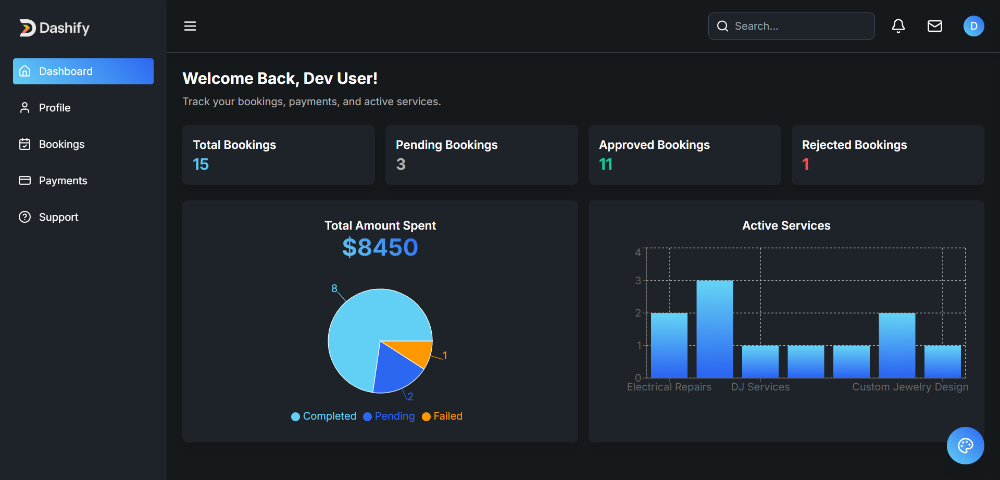
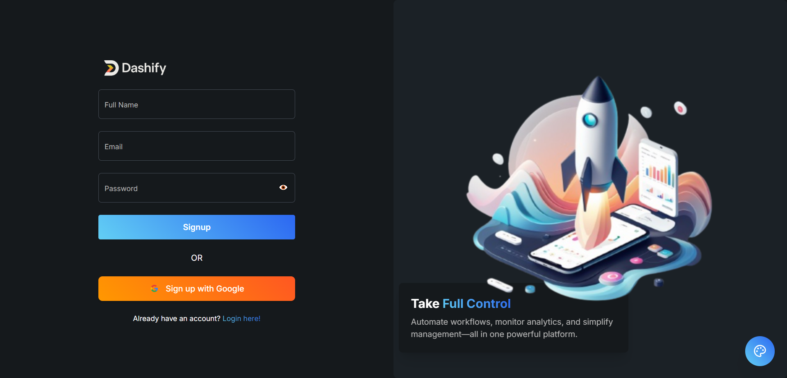
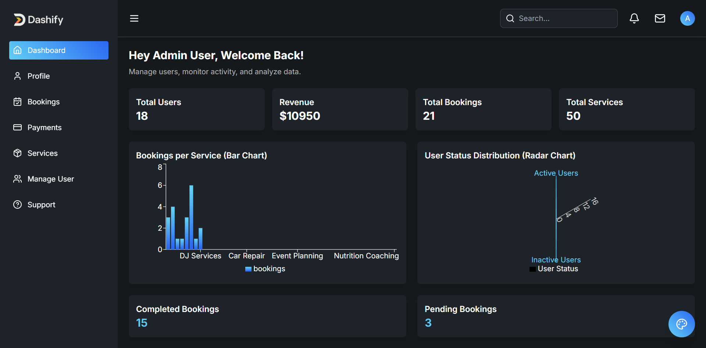

# Dashify – SaaS Admin Dashboard (React + Firebase + Tailwind)

Dashify is a modern, responsive SaaS Admin Dashboard built with React, Vite, TypeScript, and Tailwind CSS, powered by Firebase.  
It supports role-based authentication, real-time Firestore operations, theme switching, and a clean UI for scalable SaaS platforms.

---

## Screenshots

### Dashboard





## Features

- Firebase Authentication

  - Email/Password Sign In & Sign Up
  - Google Sign-In (Firebase Google Auth)
  - Password Reset via Email

- Role-Based Access

  - Admin Role: Manage services, users, and bookings
  - User Role: View and book services, track status

- Firestore CRUD

  - Real-time sync for services, bookings, and user data

- State Management

  - Global state handled via Zustand

- Data Fetching & Caching

  - Optimized API calls with @tanstack/react-query

- Client-Side Routing

  - Role-based protected routes using custom route guards

- Light/Dark Mode

  - 10 color palettes with theme switching

- Modern UI/UX
  - Responsive layout with Tailwind CSS
  - Icon support via React Icons and Lucide React
  - Toast notifications using React Toastify

---

## Tech Stack

| Library/Tool                | Purpose                           |
| --------------------------- | --------------------------------- |
| React + Vite                | Frontend framework & bundler      |
| TypeScript                  | Type checking                     |
| Tailwind CSS                | Styling                           |
| Firebase (Auth + Firestore) | Backend authentication & database |
| Zustand                     | State management                  |
| @tanstack/react-query       | Data fetching & caching           |
| React Router DOM            | Routing                           |
| React Icons + Lucide React  | Icons                             |
| React Hook Form             | Form handling                     |
| React Toastify              | Toast notifications               |
| Recharts                    | Data visualization                |

---

## Folder Structure

````bash
src/
├── assets/
│   ├── images/
│   └── styles/
│       └── globals.css
│
├── components/
├── config/
│   └── firebaseConfig.ts
│
├── context/
│   └── authContext.tsx
│
├── data/
│   └── faqs.ts
│
├── guards/
│   ├── adminGuard.tsx
│   ├── authGuard.tsx
│   └── projectGuard.tsx
│
├── layouts/
│   └── dashboardLayout.tsx
│
├── pages/
│   ├── admin/
│   ├── auth/
│   ├── bookings/
│   ├── dashboard/
│   ├── help/
│   ├── payments/
│   ├── profile/
│   └── user/
│
├── routes/
│   └── Routes.tsx
│
├── services/
│   ├── bookingApi.ts
│   ├── dashboardApi.ts
│   ├── paymentsApi.ts
│   ├── profileApi.ts
│   ├── serviceApi.ts
│   ├── userApi.ts
│   └── userDashboardApi.ts
│
├── store/
│   ├── ThemeProvider.tsx
│   └── themeStore.ts
│
├── App.tsx
└── main.tsx

---

## Getting Started

### 1. Clone the Repository

```bash
git clone https://github.com/your-username/dashify.git
cd dashify

###  Install Dependencies
npm install
# or
yarn install

### Firebase Setup
Create a Firebase project and enable:
Authentication (Email/Password and Google Sign-In)
Firestore Database
Add your Firebase configuration in a .env file:

VITE_FIREBASE_API_KEY=your_api_key
VITE_FIREBASE_AUTH_DOMAIN=your_auth_domain
VITE_FIREBASE_PROJECT_ID=your_project_id
VITE_FIREBASE_STORAGE_BUCKET=your_storage_bucket
VITE_FIREBASE_MESSAGING_SENDER_ID=your_sender_id
VITE_FIREBASE_APP_ID=your_app_id
VITE_FIREBASE_MEASUREMENT_ID=your_measurement_id
These variables are used in firebaseConfig.ts like so:

### Start Development Server
npm run dev
Open http://localhost:5173 to view the app.

##  License
This project is open-source under the MIT License.

````
